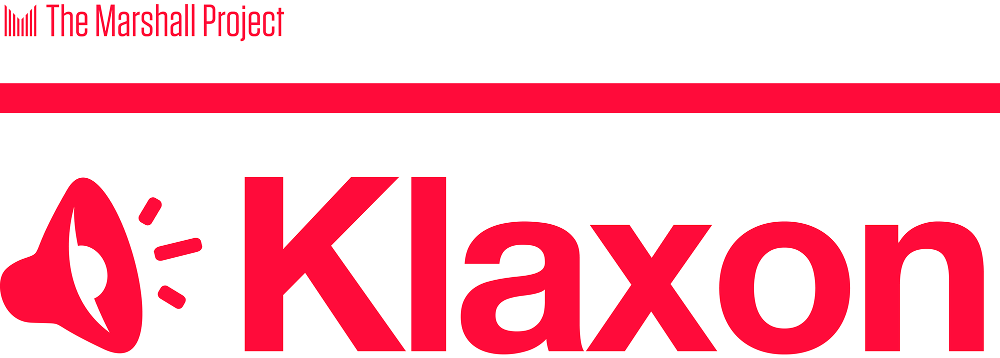

# CONTRIBUTING

Klaxon is open source software built in the newsroom of [The Marshall Project](https://www.themarshallproject.org/), a nonprofit investigative news organization covering the American criminal justice system. It was created by a team of three—Ivar Vong, Andy Rossback and Tom Meagher—and has been maintained by Gabe Isman in the years since then. It is subject to the kind of shortcomings any young, small side project might encounter. It may break unexpectedly. It may miss a change in a website, or an email might not fire off correctly. Still, we’ve found it immensely useful in our daily reporting. We want other journalists to benefit from Klaxon and to help us improve it, but keep these caveats in mind and use it at your own risk.

Our team will keep hacking on Klaxon in spare moments, and we plan to keep it humming for our own use. But we think this project has the potential to help just about any newsroom. For it to succeed and to evolve, it will depend on the contributions from other journalist-developers. We are excited about the prospect of building a community around this project to help maintain it. So when you spot the inevitable bug, please let us know. And if you’d like to help us make this better, or add new functionality to it, we’d love to have your help.

### Contribute without coding

There are several ways you can help improve Klaxon, even if you’re not a coder or you’ve never contributed to an open source project before. You can:

Help us spot bugs, including typos, and let us know by [filing an issue in Github](https://github.com/themarshallproject/klaxon/issues). If you’ve never used Github, don’t worry. Here’s a really good, quick [tutorial about discussing projects in Github Issues](https://youtu.be/KlrJVSJRUN4). Even if you’re an experienced Github user, this blog post provides some great advice on the [best practices of creating an issue](https://wiredcraft.com/blog/how-we-write-our-github-issues/).

Help test the web interface, sharing feedback with us directly [in an email](mailto:klaxon-reports@themarshallproject.org) or in a Github issue.
Help prioritize new features for the community to work on together next, by commenting on ones you like in [our Github issues](https://github.com/themarshallproject/klaxon/issues).

### Contribute code

We’re especially excited about other journalist-developers contributing code to flesh out the project and to add new features. Our motto is, “PULL REQUESTS GLADLY ACCEPTED.”

If you want to contribute, start by reviewing this advice, inspired by this post on [the Codacy blog](http://blog.codacy.com/2015/12/17/open-source-development-a-few-guidelines/) and [Shauna Gordon-McKeon’s PyCon 2015 talk](https://shaunagm.github.io/personal/pycon2015.html). Before you do anything, read the documentation in our Github repo, particularly this CONTRIBUTING.md file and our [Code of Conduct](CODE_OF_CONDUCT.md). Once you’ve done that, you’re ready to engage with the community, by commenting on issues and participating in the process.

Look for [issues](https://github.com/themarshallproject/klaxon/issues) in Klaxon’s Github repo tagged "help wanted" or “first-timer-friendly”. After you announce you’re working on an issue with a comment, fork the project. If you need help getting Klaxon running on a local development server, [follow these directions](DEVELOPING.md). Create a new branch for your feature, write a patch and send a pull request to us on Github. 

You can expect that we'll acknowledge your patch and respond with questions or comments, and we’ll expect that you’ll remain engaged with the issue, responding to our questions in a timely manner and iterating on the code until the patch is merged or otherwise closed.

### Discuss

One of the things we’re most excited about as we release Klaxon is seeing how other newsrooms put it to use. We’ll be eager to hear from you about your experiences with the tool. There are several ways we can discuss this together. You can email us directly at [klaxon-reports@themarshallproject.org](mailto:klaxon-reports@themarshallproject.org). We also have a [Google Group email list](https://groups.google.com/forum/#!forum/news-klaxon-users) where Klaxon users and developers working on the project can talk. Users can ask questions of one another, and contributors can discuss changes to the code and adding new functionality. Finally, you can always open or comment on an item in our [Github repo’s issue tracker](https://github.com/themarshallproject/klaxon/issues).