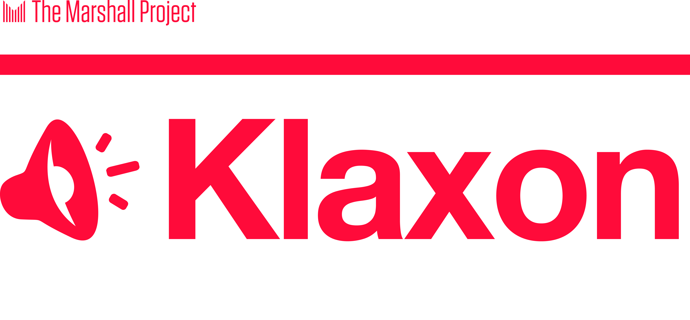
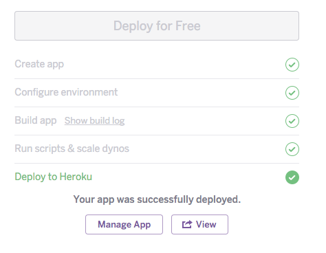
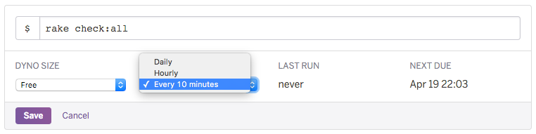
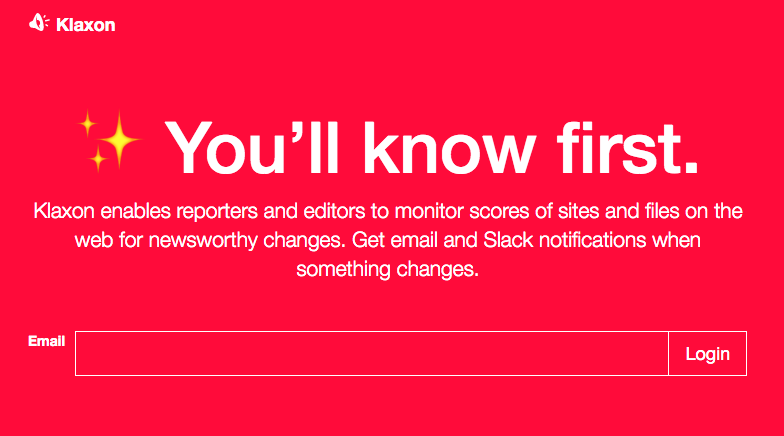
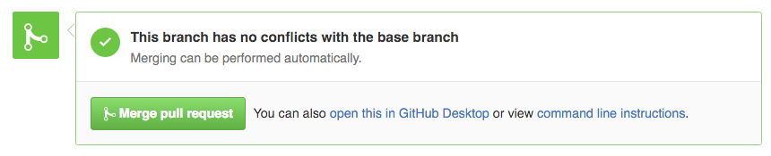

## Get emailed when a website changes

Klaxon is a free, quick to set up and easy to use *robot* that checks websites regularly so you don't have to.

You list websites you want monitored and Klaxon will visit them and, if they change, email you what's different. It saves you having to reload dozens of links yourself every day.

It's perfect for monitoring website changes you might miss, like freedom of information disclosure logs, court records, and anything related to Donald Trump. And it can even send notifications to your Slack and Discord channels.

Read more below, or say hello to the humans behind the project at the [Google Group email list](https://groups.google.com/forum/#!forum/news-klaxon-users).

## Alerting journalists to changes on the web

Built and refined in the newsroom of [The Marshall Project](https://www.themarshallproject.org/), Klaxon has provided our journalists with many news tips, giving us early warnings and valuable time to pursue stories. Klaxon has been used and tested by journalists at The Marshall Project, The New York Times, the Texas Tribune, the Associated Press [and elsewhere](NEWSROOMS.md).

The public release of this free and open source software was supported by Knight-Mozilla [OpenNews](https://opennews.org/).

## How Does Klaxon Work?

Klaxon enables users to "bookmark" portions of a webpage and be notified (via email, [Slack, or Discord](#notify-a-slack-or-discord-channel)) of any changes that may occur to those sections. [Learn more about bookmarklets on the help.md page](data/help.md).

## Setting up your Klaxon

Klaxon is open source software built in the newsroom of [The Marshall Project](https://www.themarshallproject.org/), a nonprofit investigative news organization covering the American criminal justice system. It was created by a team of three—Ivar Vong, Andy Rossback and Tom Meagher—and it is subject to the kind of shortcomings any young, small side project might encounter. It may break unexpectedly. It may miss a change in a website, or an email might not fire off correctly. Still, we’ve found it immensely useful in our daily reporting. We want other journalists to benefit from Klaxon and to help us improve it, but keep these caveats in mind and use it at your own risk.

Our team will keep hacking on Klaxon in spare moments, and we plan to keep it humming for our own use. But we think this project has the potential to help just about any newsroom. For it to succeed and to evolve, it will depend on the contributions from other journalist-developers. We are excited about the prospect of building a community around this project to help maintain it. So when you spot the inevitable bug, please let us know. And if you’d like to help us [make this better](CONTRIBUTING.md), or add new functionality to it, we’d love to have your help.

### Getting started
One of our goals for Klaxon is to make it as easy as possible for reporters and editors without tech backgrounds to use and to set up. Getting your own Klaxon running in your newsroom will require you to run a handful of instructions one time through the help of online services Heroku and Github. Following these directions, it should take maybe 10 minutes to set up your Klaxon, including the time to create accounts on Heroku and Github if you need to.

We use [Heroku](https://heroku.com/) to deploy software in The Marshall Project newsroom. We think it makes some of the tedious work of running servers a lot easier to deal with, so we designed Klaxon to be easily deployable on Heroku. (If you’d like to run this in your newsroom’s preferred server setup — say using [Docker](https://github.com/themarshallproject/klaxon/blob/develop/DOCKER.md) or a [Linux machine](https://github.com/themarshallproject/klaxon/blob/develop/install_on_ubuntu.md) — we encourage you to do so, and to send it back to us, with documentation, [in a pull request](CONTRIBUTING.md).) If you want to use our setup, you’ll need to [create an account with Heroku](https://signup.heroku.com/), if you don’t already have one.

### How much will this cost?
It should be free to get started with Klaxon on Heroku, but if you start using it a lot, you may need to pay a small amount to keep it running. Out of the box with Heroku, for free you’ll get:

* 12,000 emails per month with SendGrid
* 10,000 records of changes in your Postgres database
* Your web interface available 18 hours a day
* Checks of each of your watched sites every 10 minutes with Heroku’s Scheduler.

If you find your newsroom hitting the limits of these free tiers, you can pay to expand them. To send up to 40,000 emails a month, you can upgrade your Sendgrid add-on in Heroku for $9.95 a month. If you need to store more records in your database, you can pay $9 a month for up to 10 million rows. And if you need your web interface running around the clock, you can upgrade your Heroku dyno from the Free to the Hobby level for $7 a month. Some of these won’t be necessary, particularly in smaller newsrooms, but it’s good to know.

If you want to track files with Klaxon, you’ll have to set up an account with Amazon Web Services’ Simple Storage Service (S3). If you are tracking a few dozen files on the web that update irregularly, it should cost you pennies each month. (More on this option to come…)

### Let’s do this
If you have a Heroku account and you’re ready to go, it’s time to click on this button:

You must be logged into your Heroku account, and it will take you to a page to configure your new app in Heroku’s dashboard. First, give your app a name in the first box. While this is technically optional, this will also double as the URL for your Klaxon instance, so think carefully about it for a moment. Try maybe an abbreviation for your newsroom with a hyphen and the word klaxon, like “wp-klaxon” or “sl-klaxon”. This will become a URL as https://sl-klaxon.herokuapp.com/

Scroll down to the “* Admin_emails” field, add a comma-separated list of email addresses for your newsroom’s Klaxon administrators. These administrators will be able to create accounts for any user in your organization, as well as configure various Klaxons and integrations with services like Slack and Discord.

Click the big purple “Deploy for Free” button. If you haven’t given Heroku your credit card yet, it will ask you for your information now. As long as you’re on the free settings, it won’t charge you, but Heroku wants to be prepared in case you change tiers. After that, give Heroku a few minutes for the app to build.

When you see this message:

...you’re almost done.

Click on the button that says “Manage App”. This takes you behind the scenes of the various components powering your Klaxon. On this resources screen, click on the link for “Heroku Scheduler,” which will take you a new screen where you must add the very important piece. The scheduler is what runs every 10 minutes to actually check all the sites and pages you’re watching. Click the long, purple ‘Add new job” button. In the text box next to the dollar sign, type the words “rake check:all” with the colon and without the quotes. Under “Frequency,” change it from “Daily” to “Every 10 minutes”. Click the purple “Save” button and your scheduler item should look like this:

Unfortunately our email provider Sendgrid now requires an additional step to confirm that you are not a spammer. Your new Sendgrid account is now in a "suspended" state, and to get it unsuspended you have to contact [Sendgrid support](https://support.sendgrid.com/hc/en-us/requests/new#login-issue). You can do this by clicking the Sendgrid logo on the Resources tab. If clicking on the logo takes you to an error page, do not worry. This has been known to happen as Sendgrid's system has undergone redesigns. Instead, go to [Sendgrid's page to ask for support](https://support.sendgrid.com/hc/en-us/requests/new#login-issue). Be sure to use the same email address associated with your Heroku account and provide the url of your Klaxon instance. When they ask for "Business impact," choose "P3 General - You have a question about Sendgrid or how to use its products". This step is a nuisance, but important. **You will not be able to get an email log in to Klaxon until you are cleared by Sendgrid.** This usually happens pretty quickly (hours not days).

At the top of the scheduler page, click the link that is the name of your app (“sl-klaxon”). This will take you to back to Klaxon's dashboard. Then click the button in the upper right that says "Open app," and this should take you to your Klaxon's login screen on the web.

Type the admin email address that you gave the Heroku dashboard earlier into the text box and hit the “Login” button. You’ll then be redirected to a page that says an email has been sent to you. Check your inbox. This may take a minute or two to arrive.

In the email, click the “Go to Dashboard” button. You’re now authenticated in the system and can access your Klaxon.
Configuring your Klaxon
Once you’re logged in, you should see the main page that will fill up in the coming days with the feed of all of your Klaxon updates. Now, you want to go add other users in your newsroom to the system. Click the “Settings” button in the upper right corner, and select “Users” from the menu.

On the right side of the page, click the “Create New User” button. Add the reporter’s first and last name and email address, and she will get an email allowing her into the Klaxon. Now, finally, you and your users can start adding web pages you want Klaxon to watch.

#### Limit new users to only those on specific email domain(s)

By default, people with any email address can be added as new users. If you'd like to allow only users with *specific* email domains, set the `APPROVED_USER_DOMAINS` environment variable (or "Config Variable" in Heroku's lingo). That variable should be a comma-separated list of domains, e.g., `themarshallproject.org,nsa.gov`.

### Notify a Slack or Discord channel

You’re all set for email notifications. If you’d like to also receive alerts through Slack and/or Discord, you can set that up now too. (If you want alerts from other services, [we welcome pull requests](CONTRIBUTING.md)) Click on the “Settings” button in the upper right corner of the page and choose “Integrations” from the menu. On the Integrations page, click the “Create Slack Integration” button. You can add an integration for any number of channels in your newsroom’s Slack or Discord. For each channel, you just have to set up an Incoming Webhook.

#### Slack
In Slack, click on the dropdown arrow in the upper left corner and choose “Apps & Integrations” from the menu. This will open a new window in your browser for you to search the Slack app directory. In the search box, type “Incoming Webhooks” and choose that option when it pops up. If you already have webhooks, you’ll see a button next to your Slack organization’s name that says “Configure.” Otherwise, click the green button that says “Install”.

Now, choose the channel that you want the Klaxon alerts to go to from the dropdown menu. We’d recommend that you not send them to #General, but maybe create a new channel called #Klaxon. After you create or choose your channel, click the green button that says “Add Incoming Webhooks Integration”. Near the top of the next screen, you should see a red URL next to the label “Webhook URL”. Copy that URL and switch over to your browser window with Klaxon in it. Paste the URL into the box labeled “Webhook URL,” and type the name of the channel you want your Slack alerts to go to into the “Channel” box (this should be the same channel name you used in Slack when you created the integration). Now click the “Create Slack Integration Button”. Now you should be all set. If you want to have the ability to send Klaxon alerts to other channels, for specific reporting teams or for certain projects, you can repeat this process.

#### Discord
In Discord, click on the dropdown arrow in the upper left (next to your server name) and choose “Server Settings” from the menu. Click “Integrations” in the left sidebar, then click the “Create Webhook” button.

Now, choose the name for your webhook (you can leave it the default random name if you'd like) and choose the channel that you want the Klaxon alerts to go to. We’d recommend that you not send them to #general, but maybe create a new channel called #klaxon (you'll need to do this in your normal server view first). After you choose your channel, click “Copy Webhook URL”. Switch over to your browser window with Klaxon in it. Paste the URL into the box labeled “Webhook URL,” and type the name of the channel you want your Discord alerts to go to into the “Channel” box (this should be the same channel name you used in Discord when you created the integration). Additionally, you **must** append “/slack” (without quotes) to the end of your webhook URL, as these alerts will be sent to Discord as a Slack-Compatible Webhook. Now click the “Create Slack Integration Button”. Now you should be all set. If you want to have the ability to send Klaxon alerts to other channels, for specific reporting teams or for certain projects, you can repeat this process.

### Applying upgrades as the project develops

When we release major changes to Klaxon, we’ll make an announcement to [our Google Group email list](https://groups.google.com/forum/#!forum/news-klaxon-users). At that point, you’ll likely want to adopt those in your system as well. If you're comfortable using git on the command line, this would require just a few simple commands: pull the changes from the master branch of this repo, merge them into your forked repo and push it all to Heroku.

But if you're not a programmer, there is still a fairly painless way to upgrade by using Github and Heroku. First, you’ll need to fork our repo to your own Github account to receive the updates, and then you can use Heroku’s dashboard to push the changes to your application.

If you don’t already have an account at [Github.com](https://github.com/), now is a good time to set one up (don’t worry, it’s free). This has the added benefit of giving you access [to comment on the issues](https://github.com/themarshallproject/klaxon/issues) our community is working on developing. Once you’re logged into Github with your new account, go to [the repo for the Klaxon project](https://github.com/themarshallproject/klaxon) and click the “Fork” button. This copies our code into a separate version under your Github account that you can tie to your Klaxon instance running on Heroku’s servers.

Now, go to [https://dashboard.heroku.com](https://dashboard.heroku.com/) and choose your application (remember, the one you named when you first set up Klaxon, probably sl-klaxon or something similar if you followed our advice above). From the menu of options at the top of the page, click on the “Deploy” button. Look for section called “Deployment method,” which should be the second from the top of the Deploy page.

You should see three buttons. Click the one in the middle that says “Github Connect With Github”. The options at the bottom of the page will change. Now, click the gray button that says “Connect To Github”. It will pop up a new window to log you into Github, if you aren’t already. In that window, click the “Authorize Application” button. The popup window should now close itself.

On the Heroku page, in the “Connect to Github” section at the bottom, type ‘klaxon’ into the search box next to your Github username. Click the “Search” button. Next, click the “Connect” button next to the name of your forked repo that pops up below. Finally, select the 'master' branch from the dropdown and click “Enable Automatic Deploys” button in the “Automatic deploys” section. This ties your Heroku server to your Github account, so that every time you merge updates into your forked version of the Klaxon repository, they will automatically go live on your server with the latest updates. You'll only have to do all of this one time to set up the pipeline.

_Note: if you are upgrading from version 0.2.0 or lower, please follow the additional instructions in [migration_setup.md](migration_setup.md)_

Finally, each time an update is announced on the Google Group, you can go to your forked version of the repo on Github and click the green “New Pull Request” button to pull the changes from our master repo.

On the "basefork" dropdown on the left, click and select your repo. Then click the “compare across forks” link and change the “head fork” on the dropdown menu to “marshallproject/klaxon”. Make sure both the branches are set to “master” (they should already be). Below that, a green checkbox and the words “Able to merge” should appear. If they do, click the green “Create Pull Request” button. Give this pull request a title. You might want to say “Merging Klaxon release 0.9.1” or whatever the new version number is and click the “Create Pull Request” button again.

You should then get a response that looks like this:

If it does, and everything is green, you’re good to go. Just click the “Merge pull request” button then click the “Confirm merge” button and that’s that.

### Acknowledgements
The core contributors to Klaxon have been Ivar Vong, Andy Rossback, Tom Meagher and Gabe Isman.

We've been grateful for additional contributions to the project from:

* Jackson Gothe-Snape, SBS News
* Cameo Hill
* Emily Hopkins
* Matthew Verive
* Jason Kulatunga
* Yolanda Martinez
* Jeremy Merrill
* Ryan Murphy
* Justin Myers
* Kevin Schaul
* Ari Shapell
* Jeremy Singer-Vine
* Mike Stucka
* k.wakitani
* Bob Weston

We also owe thanks to Knight-Mozilla [OpenNews](https://opennews.org/), which supported the initial public release of this free and open source software.
